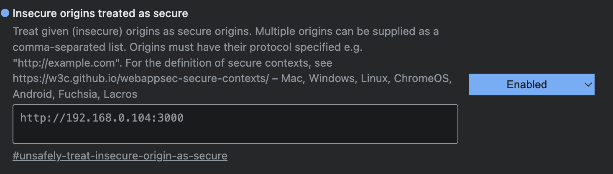

# Simple E-Meeting WEBRTC Example

clone this project and run

Client
```
cd web-rtc-client
yarn
```

Server
```
cd signaling-server-webrtc
yarn
```

### ENV

Client (./web-rtc-client/.env)
```
NEXT_PUBLIC_SIGNALING_SERVER_URL="http://192.168.0.104:8000"
```

### RUN ON DEV

```
yarn dev
```

### NOTE 
if run on local you need to enable and add the frontend url in `Insecure origins treated as secure` or [chrome://flags/#unsafely-treat-insecure-origin-as-secure](chrome://flags/#unsafely-treat-insecure-origin-as-secure)

